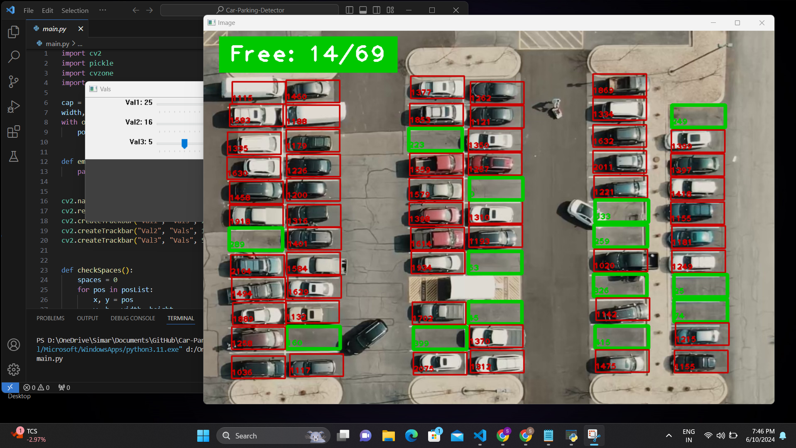

# Car-Parking-Detector
Implementation of a real-time Car Parking Spot Detector using OpenCV (Computer Vision)<br>
Detects Occupied and Free Spaces from a video footage providing valuable insights for parking management systems.

## Demonstration


## Prerequisites
- OpenCv
- Pickle
- CVZone
- Numpy

## Getting Started
### Clone the Repo

To get started with this project, you'll need to clone the repository to your local machine. You can do this using the following command in your terminal or command prompt:

```bash
git clone https://github.com/simxr/Car-Parking-Detector.git
```

### Running the Project
Once you have cloned the repository and completed any necessary setup steps, you can run the project using the following command:

```bash 
python main.py


